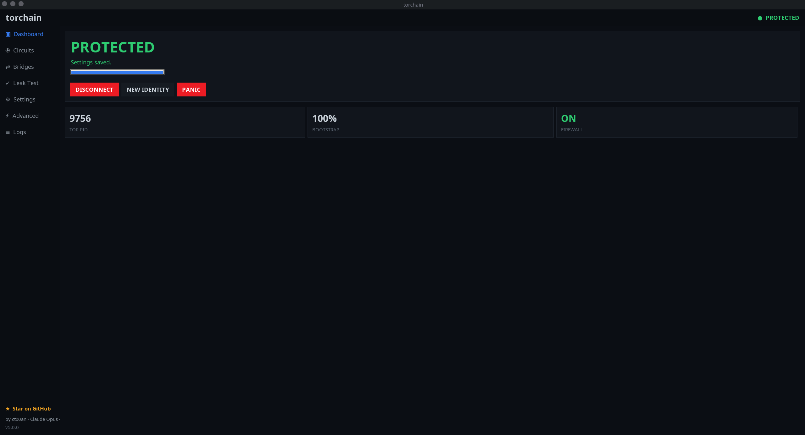
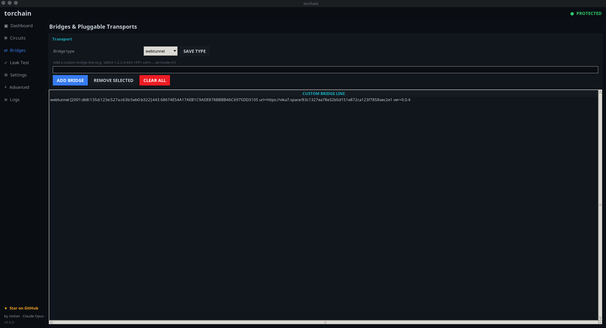
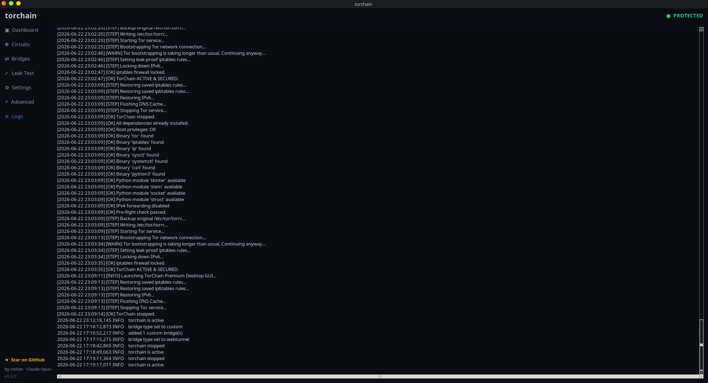
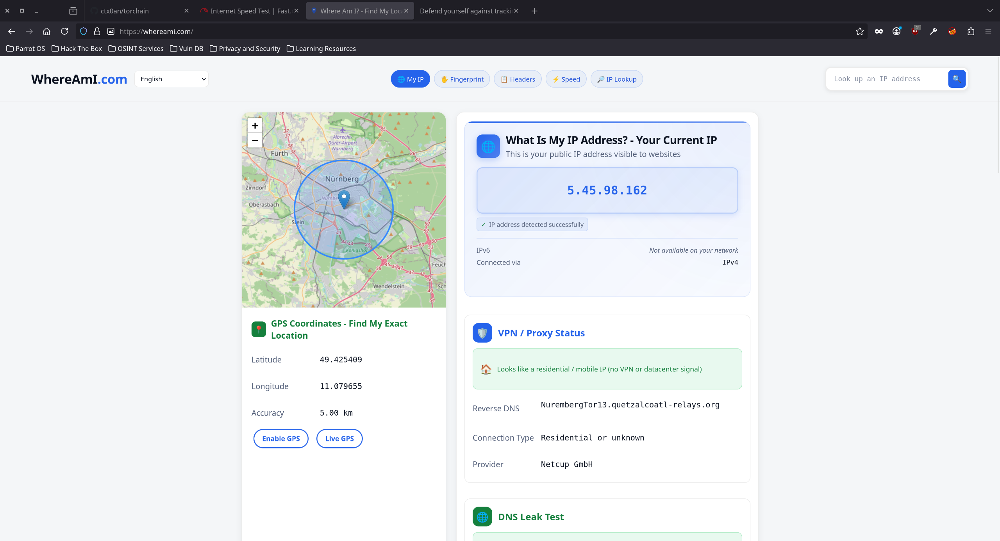

<div align="center">

# Torchain

**Fast, system-wide Tor anonymizer with an enterprise-grade Kali-themed dashboard.**

*Route every packet through Tor. Verify there are no leaks. Look good doing it.*


[](https://github.com/ctx0an/Torchain/actions/workflows/ci.yml)
[](https://github.com/ctx0an/Torchain/actions/workflows/build-portable.yml)
[](https://github.com/ctx0an/Torchain/actions/workflows/build-appimage.yml)
[](https://github.com/ctx0an/Torchain/actions/workflows/build-apk.yml)

</div>

---

## Download

Pre-built binaries for every platform. No compilation needed.

| Platform | File | Requirements |
| --- | --- | --- |
| **Windows 10/11** | [`torchain-portable.zip`](https://github.com/ctx0an/Torchain/releases/latest/download/torchain-portable.zip) | Run as administrator |
| **Linux (x86_64)** | [`Torchain-x86_64.AppImage`](https://github.com/ctx0an/Torchain/releases/latest/download/Torchain-x86_64.AppImage) | `chmod +x` then run with sudo |
| **Android** | [`app-debug.apk`](https://github.com/ctx0an/Torchain/releases/latest) | Android 8.0+ |

### Windows

1. Download `torchain-portable.zip` from [Releases](https://github.com/ctx0an/Torchain/releases/latest)
2. Extract anywhere
3. Right-click `torchain.exe` → **Run as administrator**
4. First run extracts `tor.exe` to `%ProgramData%\torchain\`

```
torchain.exe gui           # dashboard
torchain.exe start         # route traffic through Tor
torchain.exe doctor        # check dependencies
```

### Linux

1. Download `Torchain-x86_64.AppImage` from [Releases](https://github.com/ctx0an/Torchain/releases/latest)
2. Make executable and run:

```bash
chmod +x Torchain-x86_64.AppImage
sudo ./Torchain-x86_64.AppImage start    # route traffic through Tor
sudo ./Torchain-x86_64.AppImage gui      # launch dashboard
```

No installation needed. Works on Ubuntu, Debian, Fedora, Arch, Kali, and most other distros.

### Android

Download the APK from [Releases](https://github.com/ctx0an/Torchain/releases/latest) and install it. Enable "Install from unknown sources" if prompted.

---

## Install from source

If you prefer to build from source or want the latest unreleased changes:

### Linux

```bash
git clone https://github.com/ctx0an/torchain.git
cd torchain
sudo ./setup.sh
```

Installs `tor`, `iptables`, `python3`, `python3-tk`, and the torchain package to `/usr/share/torchain`.

### Windows

```batch
git clone https://github.com/ctx0an/torchain.git
cd torchain
windows\setup.bat
```

Downloads Python + extracts bundled `tor.exe`. No package manager needed.

### Build portable binaries yourself

**Windows (portable folder):**
```batch
pip install pyinstaller
windows\build_portable.bat
REM Output: dist\torchain\  (+ dist\torchain-portable.zip)
```

**Linux (AppImage):**
```bash
pip install pyinstaller
linux/build_appimage.sh
REM Output: dist/Torchain-x86_64.AppImage
```

**Android (APK):**
```bash
bash scripts/download_tor.sh
./gradlew assembleDebug
REM Output: app/build/outputs/apk/debug/app-debug.apk
```

---

## Architecture

```
torchain            ← thin bash launcher (auto-elevates everything, incl. GUI X-forwarding)
tc4/                ← Core Python package (Linux desktop engine & dashboard)
├── engine.py       ← orchestrates tor + firewall + spoofing + watchdog (fail-closed)
├── gui.py          ← event-driven Tk dashboard (no busy loops)
└── ...
tcwin/              ← Windows 11 parallel package (WinINET proxy + Firewall engine & GUI)
app/                ← Native Android application port (Jetpack Compose, Kotlin)
├── src/main/java   ← TorVpnService, TorController, and compose UI screens
└── src/main/res    ← UI assets, launcher icons, XML configurations
scripts/
└── download_tor.sh ← Helper script to fetch native libtor.so binaries
```

Each module/package does one thing. Everything is dependency-light and unit-testable.

---

## Why v5

v5 builds on the v4 rewrite and makes the whole experience **fully automatic**:

| Goal | How v5 delivers |
| --- | --- |
| **Fast startup** | Thin bash launcher + lazy-imported Python package. No work happens until you ask for it. |
| **Low memory** | Pure standard library. No background animation loops. The GUI idles at single-digit CPU and ~15 MB RAM. |
| **Fast Tor connect** | Persistent guard state, `AvoidDiskWrites`, tuned circuit timeouts, and live bootstrap polling over the control port. |
| **Fully automatic sudo** | Every privileged command — including the GUI — auto-elevates (supports `sudo`, `pkexec`, and Windows UAC). |
| **Self-healing watchdog** | A robust daemon that repairs tor/firewall if they drop and enforces automatic identity rotation. |
| **Run on boot** | One command (or checkbox) to start torchain at boot. |
| **Rich bridges** | obfs4 / snowflake / meek_lite / webtunnel plus add/remove/list, **fetch** from the Tor Project, and **test** reachability. |
| **Migration manager** | Detects ANY older torchain install, removes it, and installs v5 in its place. |
| **VM + bare-metal** | Detects VMware/VirtualBox/KVM/Xen/Hyper-V/containers and adapts. |
| **Fail-closed** | Every failure rolls back so you are never left half-protected. |
| **Enterprise design** | Kali-themed dashboard with sidebar navigation, status pills, stat tiles, and scrollable tables. |

---

## Usage

```bash
torchain doctor        # pre-flight system check
sudo torchain start    # route ALL traffic through Tor (live bootstrap bar)
torchain status        # show current protection state
sudo torchain rotate   # request a brand-new Tor identity
torchain leaktest      # verify nothing escapes Tor
sudo torchain stop     # restore normal networking
torchain gui           # launch the Kali-themed dashboard
```

### Emergency kill switch

```bash
sudo torchain panic          # drop ALL non-loopback traffic instantly
sudo torchain panic disarm   # restore
```

### Bridges (censorship circumvention)

```bash
torchain bridge type obfs4                 # obfs4|snowflake|meek_lite|webtunnel|custom
torchain bridge add 'obfs4 1.2.3.4:443 <FP> cert=... iat-mode=0'
torchain bridge list
torchain bridge remove 0                   # by index (or paste the exact line)
torchain bridge enable
torchain bridge fetch                      # fetch fresh bridges from Tor Project
torchain bridge fetch --transport webtunnel
torchain bridge test                       # TCP-ping each bridge to check reachability
torchain bridge test --timeout 10
```

### Watchdog, boot & migration

```bash
torchain watchdog start      # self-healing daemon (auto-repair + rotate)
torchain watchdog status
torchain boot enable         # start torchain automatically at boot
torchain migrate --scan      # show any older torchain installs that would be removed
torchain migrate             # remove older installs and put v5 in their place
```

### Configuration

```bash
torchain config                          # list all settings
torchain config --set exit_country=us    # pin exit nodes to a country
torchain config --set block_ipv6=true
torchain config --set spoof_mac=true
torchain config --set watchdog_enabled=true
torchain config --set auto_rotate_minutes=10
torchain config --set start_on_boot=true
```

---

## The dashboard

Launch with `torchain gui`. The window title is simply **torchain**.

The window uses a unique, procedurally-generated icon (an "onion + chain link" mark in the
Kali palette) — generated in pure Python, so no binary assets ship in the repo.

The entire UI is **event-driven** — no animation timers, no polling storms. It only
redraws a widget when the underlying value actually changes.

### Dashboard

One-click connect/disconnect, live bootstrap progress, PID / firewall / bootstrap tiles.



### Bridges

Pick a transport, add/remove/clear custom bridge lines, **fetch** 11 builtin bridges from the Tor Project via the Moat API, and **test** each bridge line with a TCP ping to confirm reachability.



### Settings

Exit country, IPv6 blocking, bridges, MAC/hostname spoofing, watchdog, boot, auto-rotation.


### Logs

Live, scrollable tail of the rotating log file.



### Leak Test

Run the full or quick suite, color-coded pass/fail — verify your real IP, DNS, and IPv6 never escape Tor.



The dashboard sidebar gives you:

- **Dashboard** — one-click connect/disconnect, live bootstrap progress, PID / firewall / bootstrap tiles.
- **Circuits** — live Tor circuit table with IP, nickname, and GeoIP country for each hop.
- **Bridges** — pick a transport, add/remove/clear custom bridge lines, fetch from Tor Project, and test reachability.
- **Leak Test** — run the full or quick suite, color-coded pass/fail.
- **Settings** — exit country, IPv6 blocking, bridges, MAC/hostname spoofing, watchdog, boot, auto-rotation.
- **Advanced** — enable boot, start/stop the watchdog, scan for old versions; shows your VM/bare-metal environment.
- **Logs** — live, scrollable tail of the rotating log file.

---

## Security model

- **Fail-closed**: if any start step fails, firewall rules and tor are rolled back so
  you are never left partially exposed.
- **No leaks by default**: IPv6 egress is blocked, DNS is forced through Tor's `DNSPort`,
  and all non-Tor TCP is dropped.
- **Reversible**: spoofing saves original values and restores them on `stop`.

See [`SECURITY.md`](SECURITY.md) for the disclosure policy.

> torchain protects the network layer only. Read [`LIMITATION.md`](LIMITATION.md) for the full threat model and limitations.

---

## Contributing

Issues and PRs welcome — see [`CONTRIBUTING.md`](CONTRIBUTING.md) and the
[`CODE_OF_CONDUCT.md`](CODE_OF_CONDUCT.md). CI runs ShellCheck, `bash -n`, and Python
byte-compilation on every push.

## Credits

Created by **ctx0an**, built with **Claude Opus 4.8**.

If torchain is useful to you, please [**star it on GitHub**](https://github.com/ctx0an/torchain) — there's also a one-click **Star on GitHub** button in the app's sidebar.

## License

MIT — see [`LICENSE`](LICENSE).

> **Disclaimer:** torchain is a tool for privacy and security research. No tool makes
> you perfectly anonymous. Understand your threat model and use responsibly and legally.
